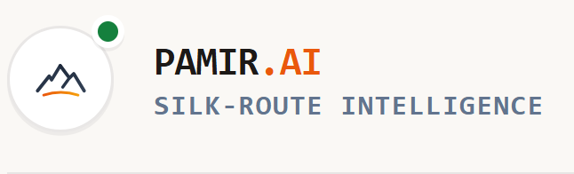
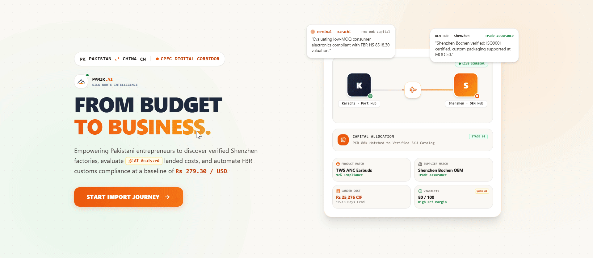

<div align="center">



# From Budget to Business.

### Silk-Route Intelligence for Pakistan–China Import Discovery

**Pamir AI** is a budget-first import intelligence platform designed to help first-time Pakistani entrepreneurs move from an available investment budget to a structured China-sourcing opportunity — with product discovery, landed-cost estimation, viability scoring, supplier outreach preparation, customs reference data, and launch planning in one workflow.

<p>
  <a href="https://pamir-ai-frontend.vercel.app/"><strong>Live Demo</strong></a>
  ·
  <a href="https://github.com/uroojbuilds/Pamir-AI"><strong>Source Code</strong></a>
</p>

</div>

---

## Product Preview



> **The idea:** start with the entrepreneur's capital, not a random product list.

Pamir is designed around a simple question:

> **"I have this much money. What can I realistically import, at what cost, from which sourcing opportunity, and what should I verify before I commit?"**

---

## Why Pamir?

Cross-border importing is difficult for first-time entrepreneurs because the decision is not just about a supplier's quoted price.

A viable opportunity depends on:

- Available capital
- Supplier price and MOQ
- Shipping weight and estimated freight
- Customs duty and tariff classification
- Data confidence
- Supplier / trade-protection information
- Expected landed cost
- Business viability
- Supplier communication
- Pre-order verification

Pamir brings these decision points into a single guided workflow.

---

## The Pamir Workflow

```text
┌──────────────────┐
│  01. SET BUDGET  │
│ Capital +        │
│ Product Category │
└────────┬─────────┘
         ↓
┌──────────────────────┐
│ 02. DISCOVER LOTS    │
│ Budget-matched       │
│ products + suppliers │
└────────┬─────────────┘
         ↓
┌──────────────────────┐
│ 03. LANDed COST      │
│ Product + freight +  │
│ customs duty         │
└────────┬─────────────┘
         ↓
┌──────────────────────┐
│ 04. VIABILITY        │
│ Explainable score +  │
│ risk interpretation  │
└────────┬─────────────┘
         ↓
┌──────────────────────┐
│ 05. MARKET / LAUNCH  │
│ Pricing intelligence │
│ + launch preparation │
└────────┬─────────────┘
         ↓
┌──────────────────────┐
│ 06. SUPPLIER RFQ     │
│ Quantity + target    │
│ price + questions    │
└────────┬─────────────┘
         ↓
┌──────────────────────┐
│ 07. IMPORT GUIDANCE  │
│ Tariff references +  │
│ verification checks  │
└──────────────────────┘
```

---

## Core Capabilities

| Capability | What Pamir does |
|---|---|
| **Budget-first discovery** | Filters sourcing opportunities against available capital and category |
| **Product & supplier catalog** | Serves structured product, supplier and sourcing data from the backend dataset |
| **Landed-cost engine** | Calculates product cost, estimated air freight and customs duty |
| **Viability scoring** | Produces a deterministic 0–100 opportunity score using data confidence, MOQ and trade-assurance fields |
| **AI viability explanation** | Optionally adds a Qwen-based explanation layer without changing the deterministic score |
| **Supplier matching** | Finds budget/category-compatible product–supplier opportunities |
| **RFQ generator** | Builds supplier outreach details, quantity, MOQ context, reference pricing and standard questions |
| **Import guidance** | Surfaces customs classification data where available and clearly separates confirmed data from guidance |
| **Marketing studio** | Generates deterministic product descriptions/captions with language options |
| **Launch kit** | Combines landed-cost, viability, marketing and pre-launch checklist information |
| **Exchange-rate reference** | Exposes curated PKR/CNY/USD conversion data and its source/status metadata |
| **Authenticated sessions** | Uses JWT authentication with bcrypt-hashed passwords |
| **PDF-ready frontend** | Includes jsPDF and AutoTable for client-side document generation |
| **Market intelligence UI** | Presents historical price / variance views in the product experience |
| **Audit-oriented UX** | The interface includes session-level change tracking and export-oriented workflows |

---

## Product Experience

### 01 — Trade Command Canvas

The journey begins with **capital allocation**.

Users choose an available investment amount and product category before Pamir starts evaluating opportunities.

This makes the workflow capital-aware from the first interaction rather than presenting an overwhelming generic marketplace.

### 02 — Alternative Lots Stream

Pamir presents candidate product lots with sourcing fields such as:

- Supplier
- FOB/reference price
- MOQ
- Estimated batch cost
- Data status
- Product category

The goal is to make the **economics of the opportunity visible before commitment**.

### 03 — Landed Cost & Viability

The landed-cost layer combines:

```text
Product Cost
    +
Estimated Shipping
    +
Customs Duty
    =
Estimated Landed Cost
```

The backend uses product weight, supplier price, shipping data, exchange-rate data and mapped duty information when calculating the estimate.

A deterministic viability score then evaluates factors including:

- Data confidence
- Trade-assurance field status
- MOQ

An optional Qwen explanation layer can explain the resulting score; it does not replace the deterministic scoring logic.

### 04 — Market Intelligence

The product experience includes historical price views designed to help an entrepreneur compare:

- Landed cost
- Domestic market price
- Gross spread
- Margin
- Historical movement
- Volatility

These views are intended for **decision support**, not as a guarantee of future selling prices.

### 05 — Supplier RFQ Engine

Once an opportunity looks interesting, Pamir can prepare a structured RFQ containing:

- Product
- Quantity
- Supplier
- MOQ
- Reference unit price
- Target price, when supplied
- Shipping destination
- Product specifications available in the dataset
- Supplier questions
- Lead-time and payment-term questions

The generated RFQ is an **outreach preparation document**, not a live supplier quotation or transaction.

### 06 — Tariff & Import Guidance

Pamir can surface product-linked customs classification information from its sourcing dataset where available, including:

- PCT / HS reference
- Duty rate
- Classification note
- Source
- Source date

Fields that are not confirmed are explicitly marked for independent verification.

---

## Architecture

```text
                         ┌───────────────────────────┐
                         │       PAMIR.AI UI         │
                         │ React + TypeScript + Vite │
                         │                           │
                         │ Command Canvas            │
                         │ Lots / Catalog             │
                         │ Landed Cost                │
                         │ Viability                  │
                         │ Market Intelligence        │
                         │ RFQ / Launch Kit           │
                         └─────────────┬─────────────┘
                                       │ REST / JSON
                                       ↓
                         ┌───────────────────────────┐
                         │      FastAPI Backend       │
                         │                           │
                         │ Auth / JWT                 │
                         │ Opportunity Discovery      │
                         │ Landed Cost                │
                         │ Business Analysis          │
                         │ Supplier Matching          │
                         │ RFQ Generation             │
                         │ Import Guidance            │
                         │ Marketing / Launch Kit     │
                         └─────────────┬─────────────┘
                                       │
                ┌──────────────────────┼──────────────────────┐
                ↓                      ↓                      ↓
        ┌───────────────┐     ┌────────────────┐     ┌────────────────┐
        │ Local datasets│     │ SQLite users DB │     │ Optional AI    │
        │ products.json │     │ JWT + bcrypt    │     │ service layer  │
        │ currency.json │     └────────────────┘     │ Qwen / others  │
        │ customs.json  │                            └────────────────┘
        │ shipping.json │
        └───────────────┘
```

---

## Technology Stack

### Frontend

- React 19
- TypeScript
- Vite
- Tailwind CSS
- Express
- React Three Fiber
- Three.js
- Recharts
- Motion
- Lucide React
- jsPDF
- jsPDF AutoTable

### Backend

- Python
- FastAPI
- Uvicorn
- Pydantic
- SQLite
- bcrypt
- PyJWT
- python-dotenv

### AI / Service Layer

The backend contains service adapters for:

- Qwen / DashScope
- Accio
- Wanx

These integrations are intentionally treated differently from the deterministic core. Qwen is an additive explanation layer. Accio and Wanx service hooks are prepared for future official API integration rather than being represented as live integrations when they are not configured or supported.

---

## Repository Structure

```text
Pamir-AI/
│
├── backend/
│   ├── Data/
│   │   ├── products.json
│   │   ├── currency.json
│   │   ├── customs.json
│   │   └── shipping.json
│   │
│   ├── services/
│   │   ├── qwen_service.py
│   │   ├── accio_service.py
│   │   └── wanx_service.py
│   │
│   ├── .env.example
│   ├── main.py
│   ├── requirements.txt
│   └── vercel.json
│
├── frontend/
│   ├── src/
│   ├── .env.example
│   ├── package.json
│   ├── server.ts
│   ├── vite.config.ts
│   └── tsconfig.json
│
├── assets/
│   ├── branding/
│   ├── demo/
│   └── product/
│
├── .gitignore
└── README.md
```

---

## API Surface

The FastAPI backend exposes REST endpoints for the core workflow.

### Public reference data

```text
GET  /
GET  /api/catalog
GET  /api/catalog/{product_id}
GET  /api/exchange-rates
```

### Authentication

```text
POST /api/signup
POST /api/login
```

### Opportunity workflow

```text
POST /api/opportunity
POST /api/landed-cost
POST /api/business-analysis
POST /api/supplier-info
POST /api/supplier-match
POST /api/rfq
POST /api/import-guidance
POST /api/marketing
POST /api/launch-kit
```

Protected workflow endpoints use the backend's Bearer-token authentication flow.

---

## Getting Started

### Prerequisites

- Python 3.10+ recommended
- Node.js
- npm

### 1. Clone

```bash
git clone https://github.com/uroojbuilds/Pamir-AI.git
cd Pamir-AI
```

### 2. Backend

```bash
cd backend

python -m venv .venv
```

Activate the environment:

**Windows PowerShell**

```powershell
.\.venv\Scripts\Activate.ps1
```

**macOS / Linux**

```bash
source .venv/bin/activate
```

Install dependencies:

```bash
pip install -r requirements.txt
```

Create your environment file:

```bash
cp .env.example .env
```

On Windows, create `.env` manually if `cp` is unavailable.

Start the API:

```bash
uvicorn main:app --reload --port 8000
```

The API will be available at:

```text
http://localhost:8000
```

FastAPI's interactive documentation is available at:

```text
http://localhost:8000/docs
```

### 3. Frontend

Open a second terminal:

```bash
cd frontend
npm install
```

Create:

```text
frontend/.env.local
```

At minimum, point the frontend at your local backend:

```env
VITE_API_BASE_URL=http://localhost:8000/api
VITE_API_AUTH_TOKEN=
```

The repository also contains configuration entries for the frontend's Gemini / AI Studio environment and demo-session bootstrap.

Start the frontend:

```bash
npm run dev
```

---

## Environment Variables

### Backend

```env
SECRET_KEY=

DASHSCOPE_API_KEY=
QWEN_MODEL=
QWEN_BASE_URL=

ACCIO_API_KEY=
ACCIO_BASE_URL=

WANX_API_KEY=
WANX_BASE_URL=
```

Keep real credentials outside Git.

### Frontend

```env
GEMINI_API_KEY=
APP_URL=
VITE_API_BASE_URL=http://localhost:8000/api
VITE_API_AUTH_TOKEN=
VITE_DEMO_EMAIL=
VITE_DEMO_PASSWORD=
```

Do not commit production secrets or real credentials.

---

## Data Integrity & Transparency

Pamir is intentionally designed to distinguish **known data, sourced data, estimates and unavailable information**.

Important implementation details:

- Exchange rates exposed by the backend are dataset snapshots, not a live market feed.
- Landed-cost calculations identify whether duty data came from a confirmed product mapping or a default fallback.
- Product and supplier records carry source/date/status fields.
- Missing product specifications are not silently fabricated.
- RFQs clearly distinguish reference dataset pricing from a live quotation.
- Trade Assurance information comes from the sourcing dataset; Pamir does not execute or guarantee Alibaba Trade Assurance transactions.
- Customs/import guidance is not presented as legal, tax or customs advice.
- The Qwen layer explains an already-calculated viability result rather than changing the underlying deterministic score.
- Accio and Wanx are wired as service-layer extension points but should not be described as active live integrations unless real credentials and supported APIs are configured.

This distinction is a feature, not a limitation: **decision-support software is more trustworthy when it tells the user what it knows and what still needs verification.**

---

## Security Notes

The backend currently includes:

- Password hashing with bcrypt
- JWT-based authentication
- Bearer-token verification
- Pydantic request validation
- Environment-based secret configuration

Before production use, review and harden:

- `SECRET_KEY`
- CORS configuration
- SQLite persistence strategy
- Production database choice
- Rate limiting
- Account/session management
- Credential rotation
- HTTPS / deployment configuration
- Production logging and monitoring

---

## Deployment

The project is structured as separate frontend and backend applications.

The repository currently includes Vercel-oriented configuration for the backend and a production build flow for the frontend.

For production deployment, configure the frontend's:

```env
VITE_API_BASE_URL=<your-backend-api>/api
```

and configure the backend secrets through the hosting provider rather than committing them to the repository.

---

## Product Principles

### Budget before browsing

The entrepreneur's available capital is the starting constraint.

### Cost before optimism

A supplier price is not the same as an import-ready cost.

### Explainable scoring

The viability score is deterministic and inspectable; AI can explain it without silently changing it.

### Evidence before claims

Data status, source and source date should remain visible whenever possible.

### Verification before commitment

Supplier quotations, customs classification, compliance requirements and buyer-protection options should be verified before a real order is placed.

---

## Roadmap

### Near-term

- [ ] Expand sourcing dataset coverage
- [ ] Add more product categories
- [ ] Improve market-price datasets
- [ ] Add stronger automated tests
- [ ] Add API health / observability endpoints
- [ ] Improve production authentication and persistence
- [ ] Add richer RFQ export formats
- [ ] Expand audit-log persistence

### Integration layer

- [ ] Connect to officially supported Accio APIs when documentation/access is available
- [ ] Connect to officially supported Wanx APIs when documentation/access is available
- [ ] Explore a verified Trade Assurance handoff/integration path
- [ ] Add live or regularly refreshed exchange-rate sources
- [ ] Add more authoritative customs data sources

### Product vision

```text
Discover
   ↓
Compare
   ↓
Calculate
   ↓
Validate
   ↓
Contact
   ↓
Launch
```

The long-term goal is to turn fragmented China–Pakistan import decisions into one transparent, capital-aware digital workflow.

---

## What Makes Pamir Different?

Most sourcing experiences begin with:

> **"What product do you want?"**

Pamir begins with:

> **"What can you afford to build?"**

That changes the entire decision flow.

Instead of forcing a first-time entrepreneur to independently connect supplier price, MOQ, freight, customs duty, risk, market pricing and supplier outreach, Pamir brings those pieces into a single decision journey.

**From budget → to opportunity → to business.**

---

## Disclaimer

Pamir AI is a decision-support and sourcing-research prototype.

It does **not** provide legal, tax, customs or financial advice. Landed costs, market prices, duty classifications, supplier information, exchange rates and other data can change or be incomplete.

Always verify current requirements and commercial terms with the supplier, FBR, WeBOC, the State Bank of Pakistan, a licensed customs clearing agent, and other relevant authorities before placing an import order.

---

## Built For

- First-time Pakistani importers
- Small-budget entrepreneurs
- China-sourcing researchers
- E-commerce founders
- Students and hackathon teams exploring trade technology
- Anyone who wants to evaluate an import opportunity before committing capital

---

<div align="center">

### PAMIR.AI

**FROM BUDGET TO BUSINESS.**

**SILK-ROUTE INTELLIGENCE**

</div>
