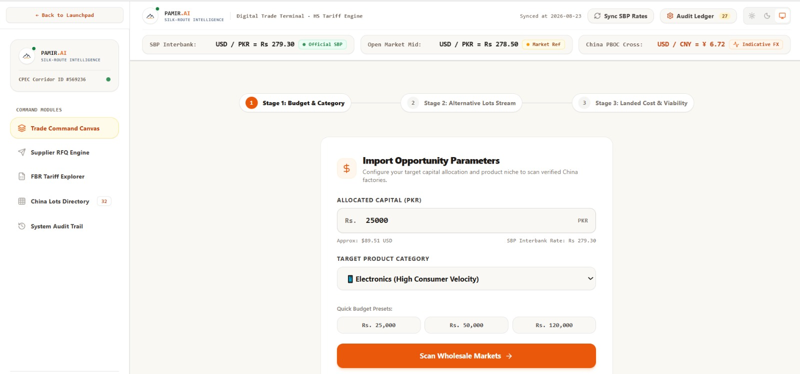
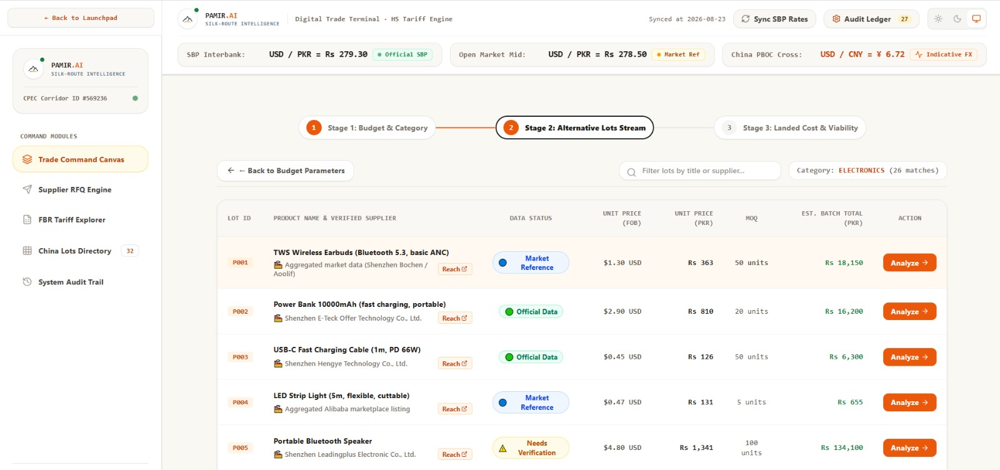
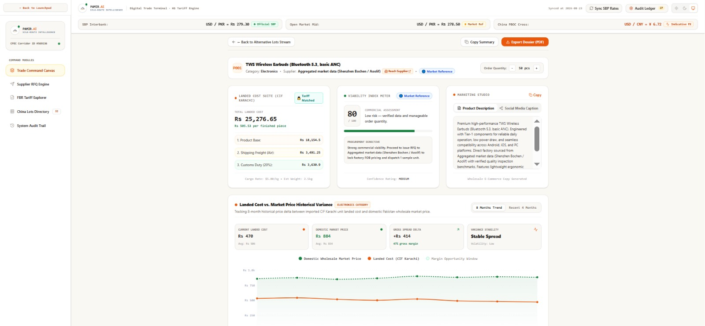
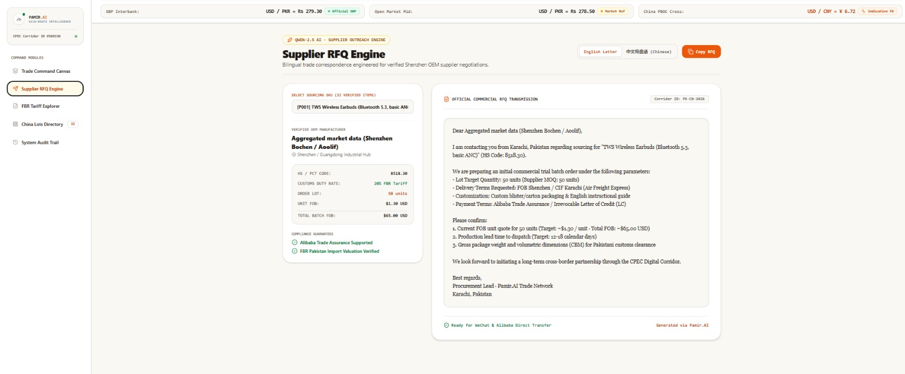
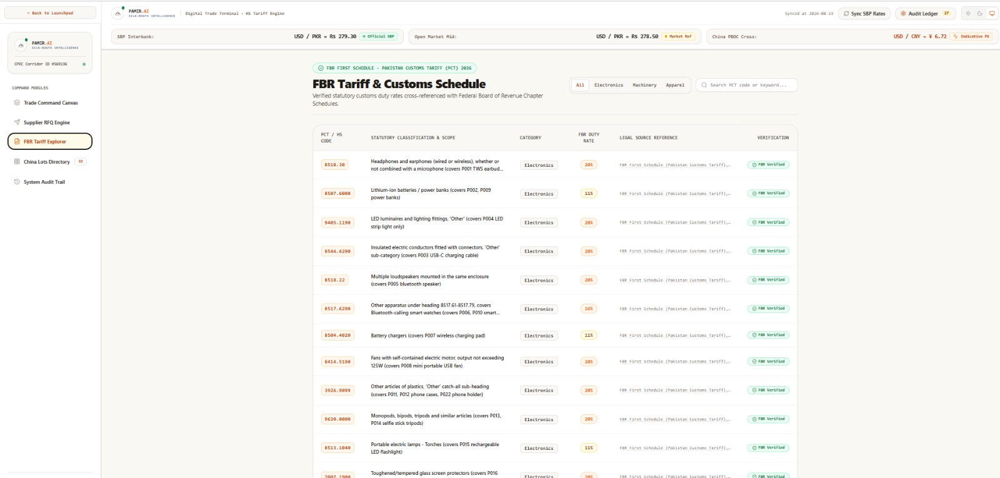
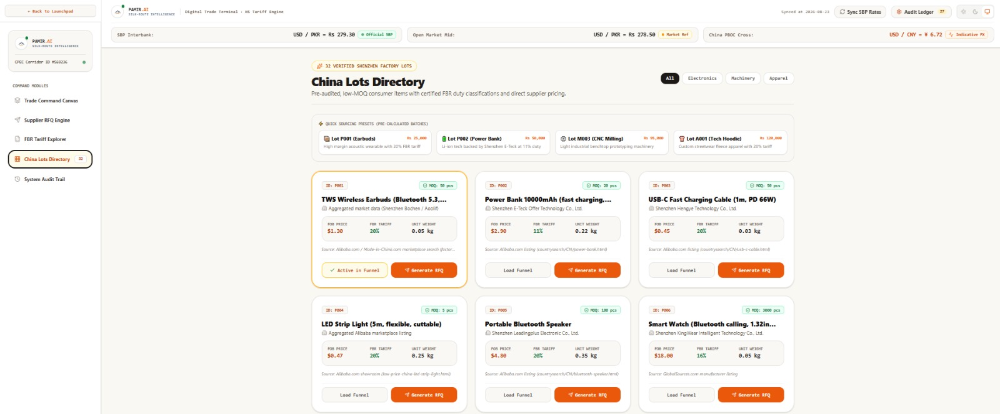
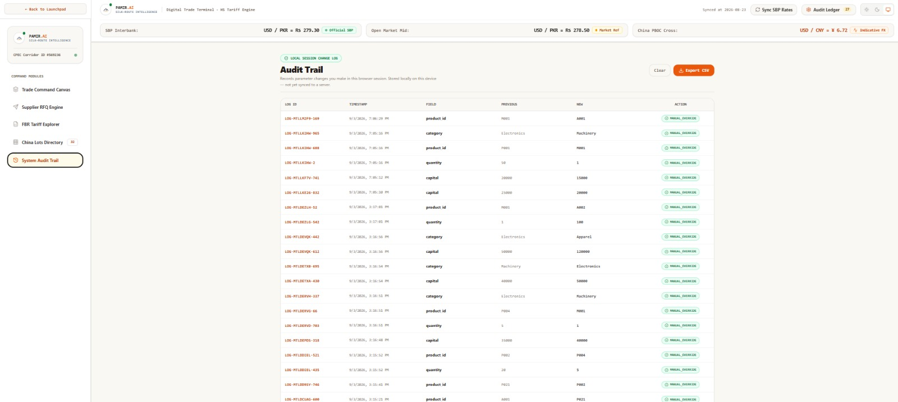

# 🏔️ Pamir AI

**AI-Powered Trade Launchpad for First-Time Pakistani Entrepreneurs**

> **Start with your budget. Discover the opportunity. Understand the real cost. Plan the launch.**

Pamir AI helps first-time Pakistani entrepreneurs and small businesses discover and evaluate China import opportunities based on their available capital — bringing **product discovery, landed-cost estimation, viability analysis, supplier information, RFQ preparation, import guidance, and marketing** into one workflow.

**Core idea:** Instead of asking *“What should I import?”*, Pamir starts with:

### 💰 “What can I realistically import with my budget?”


## 🚀 Live Demo

**Frontend:** https://pamir-ai-frontend.vercel.app/

**Backend API:** https://pamir-ai-backend.vercel.app/

**GitHub:** https://github.com/uroojbuilds/Pamir-AI


## 🎯 The Problem

For a first-time importer, finding a product is only the beginning.

They also need to understand:

* How much inventory their capital can actually support
* Product and sourcing costs
* Currency conversion
* Shipping assumptions
* Customs and tariff information
* Overall landed cost
* Whether the opportunity is financially viable
* Available supplier information
* How to approach a supplier
* How to market the product after sourcing

These decisions are often scattered across different tools, websites, spreadsheets, and conversations.

### Pamir AI brings the workflow together.

```text
Budget
   ↓
Opportunity Discovery
   ↓
Landed Cost
   ↓
Viability Analysis
   ↓
Supplier Information
   ↓
RFQ
   ↓
Import Guidance
   ↓
Marketing
   ↓
Launch
```


# ✨ Features

### 💰 Budget-First Opportunity Discovery

Pamir begins with the entrepreneur's available budget and identifies product opportunities that fit the financial constraint.




### 📦 Alternative Import Lots

Users can explore alternative lot configurations and compare different sourcing opportunities within their budget.




### 💵 Landed Cost Estimation

Pamir combines available product, currency, customs, and shipping data to estimate the potential landed cost of an import opportunity.



The system keeps numerical calculations deterministic so that the AI explanation layer does not alter the underlying financial calculations.


### 📊 Viability Analysis

Pamir evaluates an opportunity using a deterministic scoring engine and presents:

* Viability score
* Strengths
* Risks
* Warnings
* Recommendation
* Confidence

The Qwen-assisted layer explains the result without becoming the source of truth for the numerical calculation.


### 🤝 Supplier Information & Matching

Pamir organizes available supplier information and matches products with the supplier records available in its dataset.



> Supplier matching uses the supplier records available in Pamir's current dataset. The system does not fabricate competing suppliers where multiple verified records are unavailable.


### 📝 RFQ Generation

Pamir generates structured RFQ drafts that entrepreneurs can use as a starting point for supplier outreach.

> RFQs are preparation tools and are **not live supplier quotations**.


### 🧾 Customs & Import Guidance

Pamir uses structured customs/tariff information to provide product-specific import guidance where available.



> This information is provided for planning purposes and should not be treated as legal, tax, or customs advice.


### 🇨🇳 China Lots Directory

A structured interface for exploring available product and sourcing opportunities.




### 🤖 AI-Assisted Reasoning

Pamir uses a Qwen-assisted explanation layer to turn structured analysis into understandable business insights.

The AI layer is designed to:

* Explain calculated results
* Highlight strengths and risks
* Provide contextual recommendations
* Distinguish between verified, estimated, curated, and unavailable information
* Avoid inventing market demand, supplier verification, profit guarantees, or regulatory requirements


### 📣 Marketing Studio

Generate marketing copy for discovered opportunities in:

* English
* Urdu
* Roman Urdu

The current implementation uses deterministic templates, with a future-ready adapter for expanded AI media generation.


### 🚀 Launch Kit

Pamir combines key opportunity information into a practical launch-oriented workflow, helping users move from analysis toward action.


### 🔍 Transparent Decision Trail

Important decisions are designed to remain understandable instead of becoming unexplained AI recommendations.




# 🧠 How It Works

Pamir follows a hybrid **deterministic + AI-assisted** architecture.

### 1. Budget & Category Input

The entrepreneur provides their available capital and preferred product category.

### 2. Opportunity Discovery

The system searches the structured product dataset for opportunities compatible with the user's budget.

### 3. Cost Intelligence

Product cost is combined with available:

* Currency data
* Customs/tariff data
* Shipping data

to produce a landed-cost estimate.

### 4. Viability Scoring

A deterministic Python engine evaluates the opportunity.

### 5. AI Explanation

The Qwen-assisted layer explains the calculated result in natural language.

**The AI does not override the numerical engine.**

### 6. Supplier Workflow

Available supplier information is presented and can be used to prepare an RFQ.

### 7. Import Guidance

Relevant customs and import information is surfaced where available.

### 8. Marketing & Launch

The user can generate marketing content and assemble a practical launch workflow.


# 🏗️ Architecture

```text
                         ┌───────────────────────┐
                         │      User Input       │
                         │ Budget + Category     │
                         └───────────┬───────────┘
                                     │
                                     ▼
                         ┌───────────────────────┐
                         │ Opportunity Engine    │
                         │ Budget-first matching │
                         └───────────┬───────────┘
                                     │
                    ┌────────────────┼────────────────┐
                    ▼                ▼                ▼
             ┌─────────────┐ ┌─────────────┐ ┌─────────────┐
             │   Product   │ │  Currency   │ │   Customs   │
             │    Data     │ │    Data     │ │    Data     │
             └──────┬──────┘ └──────┬──────┘ └──────┬──────┘
                    │                │                │
                    └────────────────┼────────────────┘
                                     ▼
                           ┌────────────────────┐
                           │ Landed Cost Engine │
                           │ Deterministic      │
                           │ Python logic       │
                           └──────────┬─────────┘
                                      │
                                      ▼
                           ┌────────────────────┐
                           │ Viability Engine   │
                           │ Deterministic      │
                           │ scoring            │
                           └──────────┬─────────┘
                                      │
                                      ▼
                           ┌────────────────────┐
                           │ Qwen Explanation   │
                           │ Layer              │
                           └──────────┬─────────┘
                                      │
                    ┌─────────────────┼─────────────────┐
                    ▼                 ▼                 ▼
              ┌──────────┐      ┌──────────┐     ┌──────────┐
              │ Supplier │      │   RFQ    │     │ Guidance │
              └──────────┘      └──────────┘     └──────────┘
                                      │
                                      ▼
                              ┌──────────────┐
                              │ Launch Kit   │
                              │ + Marketing  │
                              └──────────────┘
```


# 🛠️ Tech Stack

| Layer                    | Technology                                            |
| ------------------------ | ----------------------------------------------------- |
| Frontend                 | React, TypeScript, Vite                               |
| UI & Styling             | Tailwind CSS, Motion, Lucide React                    |
| 3D & Visualization       | Three.js, React Three Fiber, Recharts                 |
| Backend API              | Python, FastAPI                                       |
| Authentication           | JWT, SQLite                                           |
| AI Reasoning             | Qwen-assisted explanation layer                       |
| Numerical Intelligence   | Deterministic Python scoring & cost engines           |
| HTTP / Service Layer     | HTTPX                                                 |
| Trade Data               | Product, Customs/PCT-HS, Currency & Shipping datasets |
| Document Generation      | jsPDF, jsPDF AutoTable                                |
| Future Integration Layer | Accio adapter, Wanx adapter                           |
| Deployment               | Vercel                                                |


# 🤖 AI & Integration Status

Pamir is intentionally transparent about what is implemented and what remains a future integration.

| Capability                              | Status                        |
| --------------------------------------- | ----------------------------- |
| Budget-first opportunity discovery      | ✅ Implemented                 |
| Landed-cost calculation                 | ✅ Implemented                 |
| Deterministic viability scoring         | ✅ Implemented                 |
| Qwen-assisted explanation               | ✅ Implemented when configured |
| JWT authentication                      | ✅ Implemented                 |
| Supplier information                    | ✅ Implemented                 |
| Supplier matching                       | ✅ Implemented                 |
| RFQ generation                          | ✅ Implemented                 |
| Customs/import guidance                 | ✅ Implemented                 |
| Marketing Studio                        | ✅ Implemented                 |
| Launch Kit                              | ✅ Implemented                 |
| Accio live API                          | 🔄 Future integration         |
| Wanx live API                           | 🔄 Future integration         |
| Alibaba Trade Assurance transaction API | ⏳ Not implemented             |

### Qwen Integration

Pamir's explanation layer is configured through a **secret API credential** and a compatible endpoint.

The project does **not** claim an official Qwen SDK integration.

The Qwen layer is used for explanation and contextual reasoning, while deterministic Python logic remains authoritative for numerical calculations.

### Accio & Wanx

The repository contains service adapters prepared for future integration.

The current project does not claim live Accio or Wanx API functionality because the required official credentials, endpoint specifications, and request/response schemas are not implemented in the current application.

### Trade Assurance

Pamir does not perform or guarantee Alibaba Trade Assurance transactions.

Any `trade_assurance` information in the dataset represents data available to Pamir and is **not independent transaction verification**.


# 📁 Project Structure

```text
Pamir-AI/
│
├── assets/
│   ├── branding/
│   │   └── pamir-ai-logo.png
│   │
│   ├── demo/
│   │   └── pamir-ai-demo.gif
│   │
│   └── product/
│       ├── 01-budget-category.jpeg
│       ├── 02-alternative-lots.jpeg
│       ├── 03-landed-cost-viability.jpeg
│       ├── 04-supplier-rfq.jpeg
│       ├── 05-fbr-tariff-customs.jpeg
│       ├── 06-china-lots-directory.jpeg
│       └── 07-audit-trail.jpeg
│
├── backend/
│   ├── Data/
│   │   ├── products.json
│   │   ├── customs.json
│   │   ├── currency.json
│   │   └── shipping.json
│   │
│   ├── services/
│   │   ├── qwen_service.py
│   │   ├── accio_service.py
│   │   └── wanx_service.py
│   │
│   ├── .env.example
│   ├── main.py
│   ├── requirements.txt
│   └── vercel.json
│
├── frontend/
│   ├── src/
│   ├── .env.example
│   ├── index.html
│   ├── package.json
│   ├── server.ts
│   ├── tsconfig.json
│   └── vite.config.ts
│
├── .gitignore
└── README.md
```


# 📡 API Endpoints

Pamir's backend is built with FastAPI.

## Public Endpoints

| Endpoint                    | Method | Description                           |
| --------------------------- | ------ | ------------------------------------- |
| `/`                         | GET    | Backend root / health response        |
| `/api/catalog`              | GET    | Retrieve product catalog              |
| `/api/catalog/{product_id}` | GET    | Retrieve a specific product           |
| `/api/exchange-rates`       | GET    | Retrieve available exchange-rate data |

## Authentication

| Endpoint      | Method | Description           |
| ------------- | ------ | --------------------- |
| `/api/signup` | POST   | Create a user account |
| `/api/login`  | POST   | Authenticate a user   |

## Protected Application Endpoints

| Endpoint                 | Method | Description                                                |
| ------------------------ | ------ | ---------------------------------------------------------- |
| `/api/opportunity`       | POST   | Discover budget-compatible opportunities                   |
| `/api/landed-cost`       | POST   | Calculate landed-cost estimates                            |
| `/api/business-analysis` | POST   | Generate deterministic viability analysis + AI explanation |
| `/api/supplier-info`     | POST   | Retrieve supplier information                              |
| `/api/supplier-match`    | POST   | Match products with available supplier records             |
| `/api/rfq`               | POST   | Generate RFQ draft                                         |
| `/api/import-guidance`   | POST   | Provide customs/import guidance                            |
| `/api/marketing`         | POST   | Generate marketing content                                 |
| `/api/launch-kit`        | POST   | Generate a combined launch workflow                        |


# ⚙️ Getting Started

## Prerequisites

* Python 3.10+
* Node.js / npm
* Required API credentials for enabled services


## Backend Setup

Clone the repository:

```bash
git clone https://github.com/uroojbuilds/Pamir-AI.git
cd Pamir-AI
```

Create and activate a virtual environment:

### Windows

```powershell
cd backend
python -m venv venv
venv\Scripts\activate
```

### macOS / Linux

```bash
cd backend
python3 -m venv venv
source venv/bin/activate
```

Install dependencies:

```bash
pip install -r requirements.txt
```

Create your environment file:

### Windows

```powershell
copy .env.example .env
```

### macOS / Linux

```bash
cp .env.example .env
```

Configure the required values in `.env`.

Start the API:

```bash
uvicorn main:app --reload
```

The local API will be available at:

```text
http://127.0.0.1:8000
```

FastAPI interactive documentation:

```text
http://127.0.0.1:8000/docs
```


# 💻 Frontend Setup

Open a second terminal:

```bash
cd frontend
```

Install dependencies:

```bash
npm install
```

Create the environment file:

### Windows

```powershell
copy .env.example .env
```

### macOS / Linux

```bash
cp .env.example .env
```

Configure the backend API URL according to the variables documented in `frontend/.env.example`.

Start the development server:

```bash
npm run dev
```

Build the production frontend:

```bash
npm run build
```


# 🔐 Environment Variables

Backend environment configuration is documented in:

```text
backend/.env.example
```

The project uses environment variables for secrets and service configuration.

Typical configuration includes:

```text
SECRET_KEY=

DASHSCOPE_API_KEY=
QWEN_MODEL=
QWEN_BASE_URL=

ACCIO_API_KEY=
ACCIO_BASE_URL=

WANX_API_KEY=
WANX_BASE_URL=
```

### Security

* API credentials are never intended to be committed to Git.
* `.env` files are excluded through Git configuration.
* Secrets are supplied through environment variables.
* Service credentials are separated from application logic.

> **Never commit real API keys, tokens, passwords, or other secrets to the repository.**

---

# ☁️ Deployment

Pamir AI is structured as separate frontend and backend deployments.

### Frontend

```text
Vercel
   ↓
React + TypeScript + Vite
```

### Backend

```text
Vercel
   ↓
FastAPI + Python
```

The frontend communicates with the backend through the configured API base URL.

### Serverless Database Consideration

The current authentication implementation uses SQLite.

Because serverless environments do not provide the same persistent local filesystem guarantees as a traditional server, SQLite should not be considered the final production database architecture.

A future production deployment should migrate persistent user data to a managed database.


# 📊 Data Architecture

Pamir currently works with structured datasets stored under:

```text
backend/Data/
```

### Product Data

Contains the structured product opportunities used by the application.

### Customs Data

Contains available customs/PCT-HS information and applicable duty data.

### Currency Data

Provides exchange-rate information used by the cost-estimation workflow.

### Shipping Data

Provides shipping assumptions used by the landed-cost engine.

This structured approach allows the system to produce repeatable calculations rather than relying entirely on free-form AI responses.


# 🛡️ Reliability & Transparency

Pamir is designed around an important principle:

## **AI should explain the decision — not invent the numbers.**

The system therefore separates:

### Deterministic Information

* Product data
* Currency conversion
* Customs data
* Shipping assumptions
* Landed-cost calculations
* Viability scoring

### AI-Assisted Information

* Explanation
* Contextual reasoning
* Strengths
* Risks
* Recommendations

The AI layer is instructed not to fabricate:

* Market demand
* Sales volume
* Competitor data
* Supplier verification
* Profit guarantees
* Customs/legal requirements

When information is unavailable, incomplete, or estimated, the application is designed to communicate that limitation.


# ⚠️ Important Limitations

Pamir AI currently does **not** claim to:

* Guarantee profit
* Guarantee product demand
* Independently verify every supplier
* Provide legal or tax advice
* Provide binding customs advice
* Generate live supplier quotations
* Execute Alibaba Trade Assurance transactions
* Replace professional import/export advice

Pamir is a decision-support prototype, not a substitute for independent commercial and regulatory verification.


# 🗺️ Roadmap

## Phase 1 — MVP

* [x] Budget-first opportunity discovery
* [x] Landed-cost estimation
* [x] Deterministic viability scoring
* [x] Qwen-assisted explanations
* [x] Supplier information
* [x] Supplier matching
* [x] RFQ generation
* [x] Customs/import guidance
* [x] Marketing Studio
* [x] Launch Kit
* [x] JWT authentication
* [x] Transparent decision workflow

## Phase 2 — Data & Integrations

* [ ] Live Accio integration
* [ ] Live Wanx integration
* [ ] Expanded product catalog
* [ ] Broader customs coverage
* [ ] Improved shipping intelligence
* [ ] Additional supplier sources
* [ ] Managed production database

## Phase 3 — Advanced Intelligence

* [ ] Market trend signals
* [ ] Historical opportunity analytics
* [ ] Demand indicators
* [ ] Scenario simulation
* [ ] Sensitivity analysis
* [ ] Smarter capital allocation
* [ ] Personalized opportunity ranking

## Phase 4 — Trade Launch Platform

* [ ] Supplier communication workspace
* [ ] Import milestone tracking
* [ ] Purchase/order workflow
* [ ] Business performance analytics
* [ ] Personalized launch plans
* [ ] Expanded Pakistan-China trade intelligence


# 🌏 Long-Term Vision

Pamir AI aims to evolve from an opportunity-analysis tool into a broader **trade intelligence and launch platform**.

```text
Capital
   ↓
Opportunity Discovery
   ↓
Cost Intelligence
   ↓
Viability
   ↓
Supplier Discovery
   ↓
Import Planning
   ↓
Marketing
   ↓
Launch
   ↓
Business Intelligence
```

### The vision:

> **Make data-driven importing more accessible to entrepreneurs starting with limited capital.**


# 📸 Product Walkthrough

| Step | Product Experience          |
| ---- | --------------------------- |
| 01   | Budget & Category Selection |
| 02   | Alternative Import Lots     |
| 03   | Landed Cost & Viability     |
| 04   | Supplier & RFQ              |
| 05   | Customs & Tariff Guidance   |
| 06   | China Lots Directory        |
| 07   | Transparent Audit Trail     |

All product visuals are included in the repository under:

```text
assets/product/
```


# 🏆 Current Status

### **Functional MVP — Deployed**

Pamir AI currently provides an end-to-end workflow covering:

**Discovery → Analysis → Costing → Supplier Workflow → RFQ → Guidance → Marketing → Launch**

The architecture is also prepared for future external service integrations while clearly distinguishing implemented functionality from planned integrations.


# 👥 Team

Built by a team exploring the intersection of:

**AI × Trade × Data × Entrepreneurship**

## 👥 Team

| Member | Role |
|---|---|
| Urooj Fatima | Team Lead & AI |
| Asra Zia | AI / Engineering |
| Amna Zaheer | Data Analyst |
| Kashaf Fatima | UI/UX fronted designer |


# 🏔️ Why "Pamir"?

The Pamir region has historically connected important trade routes across Central and South Asia.

The name reflects the project's core idea:

> **Connecting entrepreneurs with opportunities across borders.**


# ❤️ Built With Purpose

Pamir AI was built around one belief:

## **Limited capital should not mean limited opportunity.**

Instead of expecting new entrepreneurs to understand complex import economics before they can begin, Pamir attempts to turn that complexity into a structured, understandable workflow.

**Start with the budget.
Understand the numbers.
Evaluate the opportunity.
Plan the launch.**


<p align="center">

### 🏔️ Pamir AI

**From limited capital to informed trade opportunities.**

Built with **React, TypeScript, FastAPI, Python, structured trade data, and AI-assisted reasoning.**

</p>
